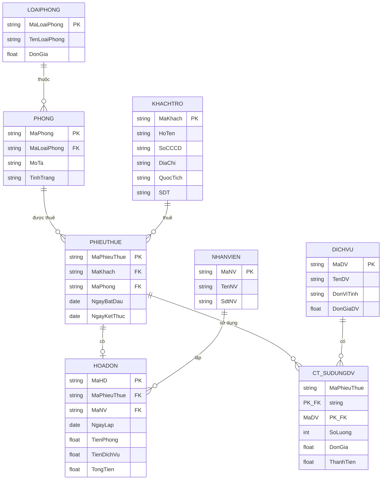

# BÀI 3: QUẢN LÝ KHÁCH SẠN

Một khách sạn cần xây dựng hệ thống thông tin về việc thuê phòng và sử dụng các dịch vụ của khách trọ bao gồm các chức năng sau:

1. Quản lý phòng, quản lý khách trọ
2. Quản lý các dịch vụ
3. Tìm kiếm thông tin về phòng thuê: loại phòng, giá tiền
4. Tìm kiếm thông tin về các dịch vụ của khách sạn: tên dịch vụ, đơn vị tính, đơn giá
5. Tính tiền và in hóa đơn cho khách trọ (tiền thuê phòng + tiền sử dụng dịch vụ)
6. Thống kê số khách trọ theo ngày thuê
7. Thống kê tổng doanh thu theo tháng

- Thông tin về phòng gồm mã phòng, loại phòng
- Thông tin về khách trọ gồm mã khách, họ tên, số CCCD, địa chỉ, quốc tịch
- Một khách trọ có thể đến thuê phòng tại khách sạn này nhiều lần
- Thông tin mỗi lần thuê của một khách gồm phòng thuê, ngày bắt đầu, ngày kết thúc
- Giả sử tất cả các phòng đều là phòng đơn (phòng một người)
- Đơn giá thuê/một ngày của một phòng được ấn định trước tùy theo phòng thuộc loại nào
- Trong mỗi lần thuê phòng, khách trọ có thể trả thêm các khoản tiền về dịch vụ (như điện thoại, ăn uống, karaoke,...)

---

**LoaiPhong (Loại Phòng):** MaLoaiPhong, TenLoaiPhong, DonGia
→ *(Tách riêng vì đơn giá thuê/ngày được ấn định theo loại phòng)*

**Phong (Phòng):** MaPhong, MaLoaiPhong, MoTa, TinhTrang
→ *(Mỗi phòng thuộc một loại phòng; TinhTrang: Trống/Đang thuê)*

**KhachTro (Khách Trọ):** MaKhach, HoTen, SoCCCD, DiaChi, QuocTich, SDT
→ *(Theo đề: mã khách, họ tên, số CCCD, địa chỉ, quốc tịch; thêm SDT để liên lạc)*

**Thông tin thuê mỗi lần khách thuê (PhieuThue):** MaPhieuThue, MaKhach, MaPhong, NgayBatDau, NgayKetThuc
→ *(Một khách có thể thuê nhiều lần; mỗi lần gồm phòng thuê, ngày bắt đầu, ngày kết thúc)*

**DichVu (Dịch Vụ):** MaDV, TenDV, DonViTinh, DonGiaDV
→ *(Theo chức năng 4: tên dịch vụ, đơn vị tính, đơn giá)*

**CT_SuDungDV (Chi Tiết Sử Dụng Dịch Vụ):** MaPhieuThue, MaDV, SoLuong, DonGia, ThanhTien
→ *(Mỗi lần thuê, khách có thể sử dụng nhiều dịch vụ; ThanhTien = SoLuong × DonGia)*

**NhanVien (Nhân Viên):** MaNV, TenNV, SdtNV
→ *(Nhân viên lập hóa đơn)*

**HoaDon (Hóa Đơn):** MaHD, MaPhieuThue, MaNV, NgayLap, TienPhong, TienDichVu, TongTien
→ *(Chức năng 5: tính tiền = tiền thuê phòng + tiền sử dụng dịch vụ)*

---

## PHẦN 2: SƠ ĐỒ THỰC THỂ - MỐI KẾT HỢP (ERD)

### Giải thích mối quan hệ:

| Thực thể 1 | Quan hệ | Thực thể 2 | Loại | Giải thích |
|---|---|---|---|---|
| LoaiPhong | thuộc | Phòng | 1 - N | Một loại phòng có nhiều phòng |
| Phòng | được thuê | PhieuThue | 1 - N | Một phòng được thuê nhiều lần |
| KhachTro | thuê | PhieuThue | 1 - N | Một khách thuê nhiều lần |
| PhieuThue | có | HoaDon | 1 - 1 | Mỗi lần thuê có một hóa đơn |
| PhieuThue | sử dụng | CT_SuDungDV | 1 - N | Mỗi lần thuê dùng nhiều dịch vụ |
| DichVu | có | CT_SuDungDV | 1 - N | Một dịch vụ được dùng nhiều lần |
| NhanVien | lập | HoaDon | 1 - N | Một nhân viên lập nhiều hóa đơn |
